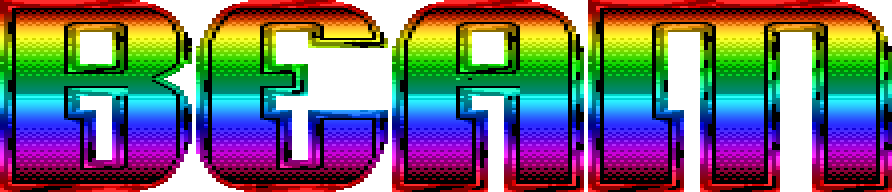

# Beam Renderer

"Beam is a tiny, game focused, WebGL and Canvas Renderer."

## To Build

After `npm install`:

`rollup -c`

Will output the build files to the `dist` folder.

## Examples

Can be found in `examples`

## Philosophy:

* ES6 (+ ES5 transpiled lib provided)
* TypeScript Defs
* Roll-Up (tree shaking) module builder
* Rendering features only: No asset loader, interactions, etc.

## Change Log

### September 14th 2016

* Rectangle class added
* First pass at CanvasRenderer added
* Sprite class added
* Many Rect and Many Image tests added (Transform code running fast, rendering eating CPU)

### September 13th 2016

* Deferred Transform class option (dirty flag check)
* Core child management functions (removeChild, addChildAt, getChildAt, etc)

### September 12th 2016

* Transform Class with immediate propagation to children.
* Transform features: Scale, Rotation, Position, Pivot.
* Examples

## TODO

* Bounds calculation
* Dirty parent checks
* Interpolation Option
* Shear Tests
* Get Position Functions (for hit testing when deeply translated)
* Render filled rectangles (WebGL + Canvas) based on Transform
* Rectangle features: Size, Color
* Context loss handling
